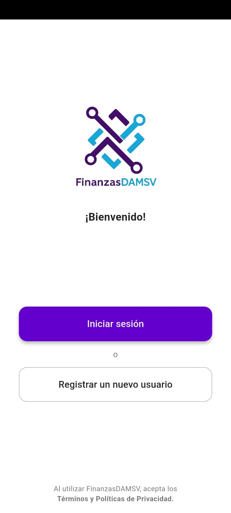
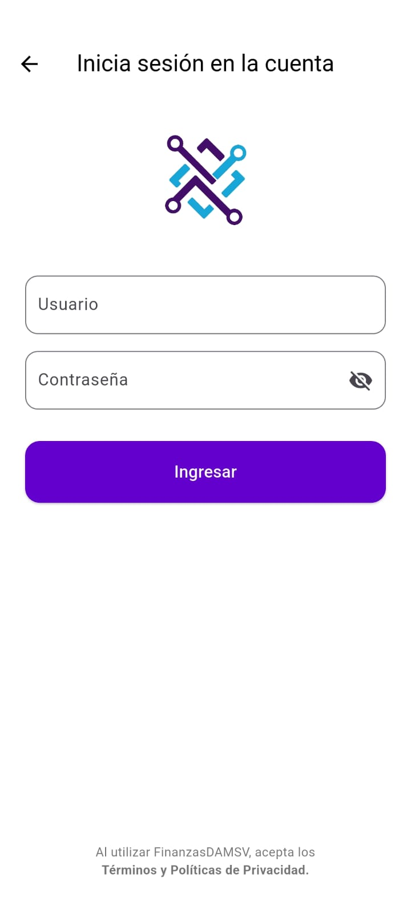
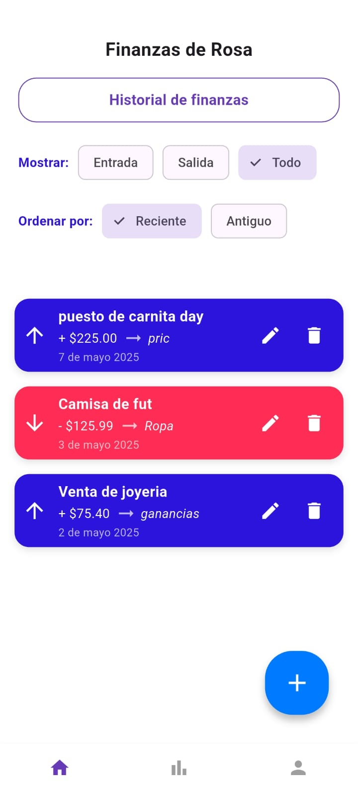
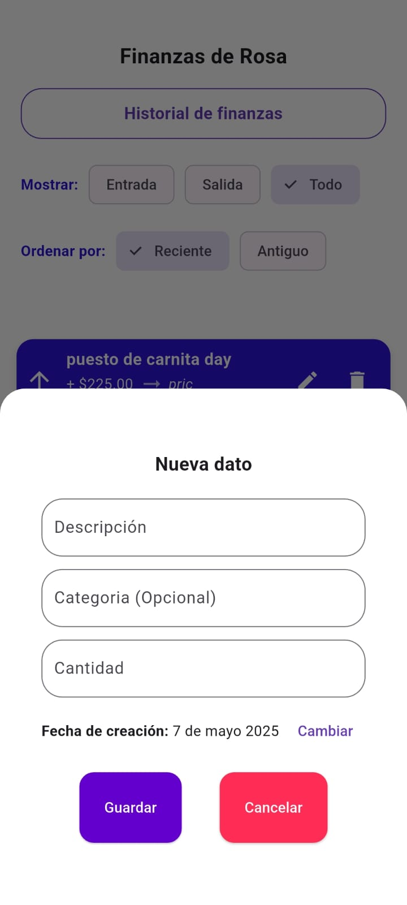
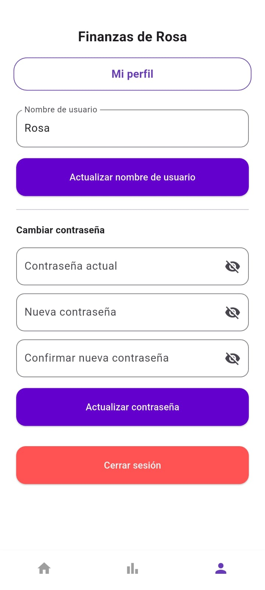
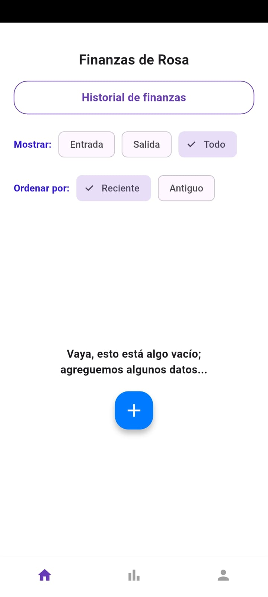

# FinanzasDAMSV 💰📱

**FinanzasDAMSV** es una aplicación móvil desarrollada en Flutter que permite llevar un control organizado de tus finanzas personales de forma sencilla, visual y segura. Diseñada para ofrecer funcionalidad sin conexión, protege tus datos mediante un sistema de cifrado básico utilizando tu contraseña.

**NOTA:** Este proyecto fue realizado para la materia de desarrollo de aplicaciones móviles impartida en el técnico superior universitario de Desarrollo de software en código abierto en la Escuela Superior de Innocación  y Tecnología de El Salvador.

---

## 📸 Capturas de pantalla

| Bienvenida | Registro | Inicio de sesión |
|-----------|----------|------------------|
|  |  |  |

| Inicio | Dashboard | Nuevo Registro |
|--------|-----------|----------------|
|  |  |  |

| Perfil | Sin Datos |
|--------|-----------|
|  |  |

---

## 🚀 Funcionalidades principales

### 📋 Registro de transacciones
- Permite agregar una transacción con:
  - Descripción
  - Categoría (opcional)
  - Monto (positivo o negativo)
  - Fecha de realización

### 🔍 Seguimiento y organización
- Filtro por tipo: `Entrada`, `Salida`, o `Todo`
- Ordenamiento por fecha: `Reciente` o `Antiguo`

### 📊 Visualización en Dashboard
- Gráfico mensual del comportamiento de tus transacciones
- Resumen rápido:
  - Beneficio total del mes
  - Mayor ingreso
  - Mayor pérdida

---

## 🔐 Seguridad y almacenamiento local

FinanzasDAMSV utiliza **SharedPreferences** para almacenar datos localmente, lo que permite:
- Funcionar sin conexión a internet
- Garantizar acceso rápido y confiable a los datos
- Cifrar los datos usando un sistema de **encriptación básica** con XOR, derivando la clave desde la contraseña del usuario
- Actualizar nombre de usuario y contraseña sin perder tus registros, re-encriptando automáticamente tus datos
